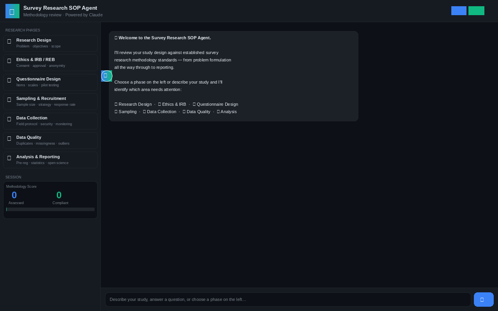
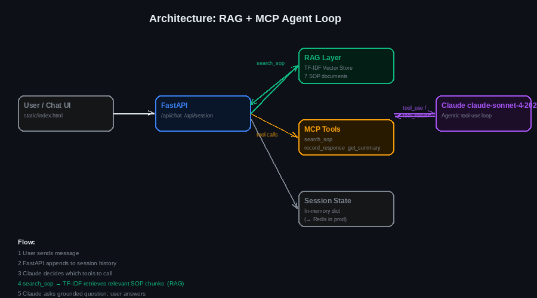
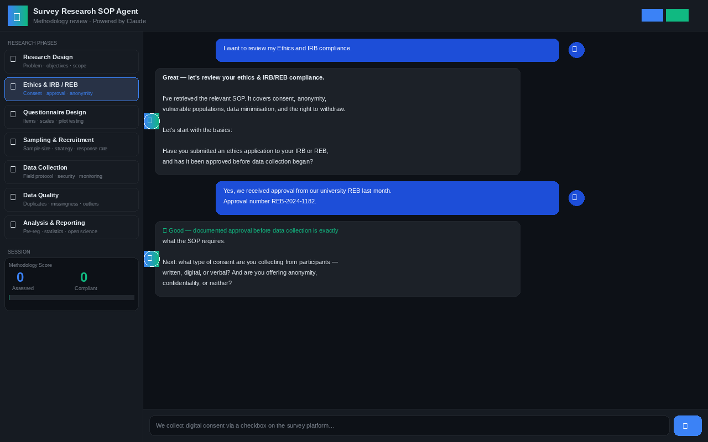
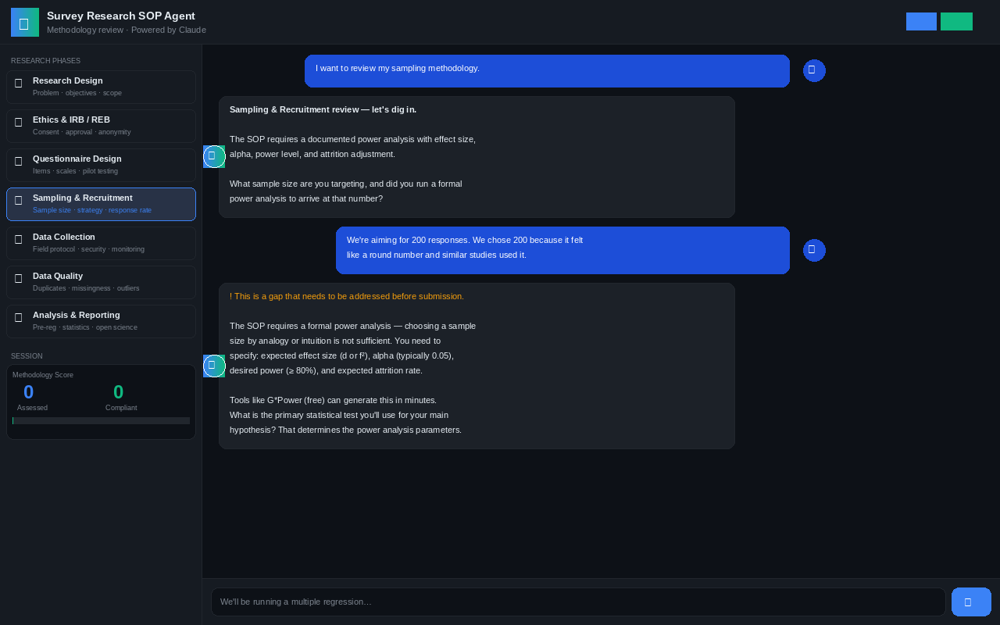
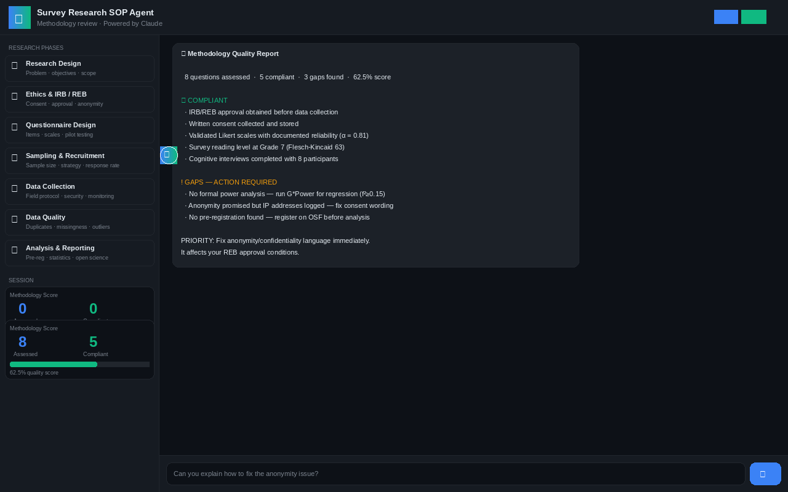

# 🔬 Survey Research SOP Agent

> A conversational methodology advisor that reviews your survey research design against established SOPs — powered by **RAG + MCP + Claude**.



---

## What it does

The Survey Research SOP Agent acts as a senior research methods consultant. You describe your study; it retrieves the relevant Standard Operating Procedure text, asks targeted questions about your methodological choices, records each answer with a compliance assessment, and produces a prioritised quality report.

**Every question is grounded in real SOP content** — the agent never invents requirements.

---

## Architecture



### How RAG and MCP work together

| Layer | What it does |
|---|---|
| **RAG** (`search_sop`) | Before asking any question, the agent calls `search_sop`. A TF-IDF vector store ranks all 7 SOP documents by semantic similarity and returns the top-3 chunks. The agent's questions are grounded in that retrieved text — not its training data. |
| **MCP tool — `record_survey_response`** | After each answer the agent calls this tool to persist the question, verbatim answer, and a `compliant: true/false` flag with auditor notes. |
| **MCP tool — `get_survey_summary`** | Called at the end of the session to return the full compliance record, score, and gaps. |
| **Agentic loop** | Claude runs a `tool_use` → `tool_result` loop autonomously. No manual orchestration. Each turn: retrieve SOP → ask question → record answer → repeat. |

```
User message
    │
    ▼
FastAPI /api/chat
    │
    ├──► Claude (claude-sonnet-4-20250514)
    │        │
    │        ├── tool_use: search_sop ──► TF-IDF Vector Store ──► top-3 SOP chunks
    │        │                                                          │
    │        │◄─────────────────────── tool_result ◄───────────────────┘
    │        │
    │        ├── (asks grounded question; waits for user)
    │        │
    │        ├── tool_use: record_survey_response ──► Session state
    │        │
    │        └── tool_use: get_survey_summary ──► compliance report
    │
    └──► JSON response to UI
```

---

## Screenshots

### 1 · Choosing a research phase

Click any phase in the sidebar and the agent immediately retrieves the relevant SOP and begins the review.


---

### 2 · Ethics & IRB review

The agent opens by confirming what the SOP requires, then asks precise questions about approval timing, consent type, and anonymity vs. confidentiality distinctions.



---

### 3 · Gap detected — Sampling methodology

When a researcher says they chose their sample size because "it felt like a round number", the agent flags the gap, explains the SOP requirement, and directs them to G\*Power for a proper power analysis.



---

### 4 · Full methodology quality report

After 5–8 questions the agent calls `get_survey_summary` and presents a structured report: overall score, compliant items, gaps with specific remediation steps, and a priority action.



---

## SOP Knowledge Base

Seven survey research SOPs are loaded into the RAG vector store at startup:

| ID | SOP | Key requirements |
|---|---|---|
| sop-001 | Research Design & Problem Formulation | Research question, power analysis, RDD sign-off |
| sop-002 | Ethics & IRB / REB Compliance | Consent, anonymity vs confidentiality, vulnerable populations |
| sop-003 | Questionnaire Design & Instrument Development | Item writing, validated scales, Flesch-Kincaid ≥ 60, pilot testing |
| sop-004 | Sampling Methodology & Recruitment | Power analysis inputs, inclusion criteria, ≥ 60% response rate |
| sop-005 | Data Collection & Field Procedures | Platform validation, TLS encryption, speeder detection |
| sop-006 | Data Quality, Cleaning & Validation | Duplicate detection, attention checks, cleaning log, dataset freeze |
| sop-007 | Analysis, Reporting & Dissemination | Pre-registration, effect sizes, multiple comparison correction, open data |

---

## Project Structure

```
sop-survey-agent/
├── main.py               ← FastAPI app: RAG vector store + MCP tools + agentic loop
├── requirements.txt
├── render.yaml           ← One-click Render deployment
├── static/
│   └── index.html        ← Chat SPA (no build step)
└── docs/
    ├── 01_welcome.png
    ├── 02_ethics_review.png
    ├── 03_sampling_gap.png
    ├── 04_report.png
    └── 05_architecture.png
```

---

## Local Development

```bash
# 1. Clone / copy the folder
cd sop-survey-agent

# 2. Install dependencies
pip install -r requirements.txt

# 3. Set your Anthropic API key
export ANTHROPIC_API_KEY=sk-ant-...

# 4. Run
uvicorn main:app --reload --port 8000

# 5. Open http://localhost:8000
```

---

## Deploy to Render

The repo includes `render.yaml` — no manual configuration needed.

1. Push this folder to a GitHub repository
2. Go to [render.com](https://render.com) → **New → Web Service**
3. Connect the repository — Render detects `render.yaml` automatically
4. In **Environment**, add `ANTHROPIC_API_KEY` (never commit this)
5. Click **Deploy**

> **Note:** The free plan spins down after 15 min of inactivity (cold start ~30 s). Upgrade to **Starter** for always-on.

---

## API Reference

| Method | Endpoint | Description |
|---|---|---|
| `POST` | `/api/chat` | Send a message; body: `{ "message": "...", "session_id": "uuid" }` |
| `GET` | `/api/session/{id}` | Return raw session state (responses + compliance flags) |
| `GET` | `/api/health` | Health check; returns `{ "status": "ok", "sops_loaded": 7 }` |

---

## Production Upgrade Path

| Area | Prototype | Production swap |
|---|---|---|
| Vector store | TF-IDF (scikit-learn) | `chromadb`, `pgvector`, Pinecone |
| Embeddings | TF-IDF | `text-embedding-3-small`, `all-MiniLM-L6-v2` |
| Session state | Python dict (in-memory) | Redis, Postgres |
| SOP documents | Hard-coded list | Load from S3 / SharePoint / DB at startup |
| Auth | None | OAuth2 / JWT via FastAPI middleware |
| Observability | None | LangSmith, Helicone, or OpenTelemetry |
| MCP protocol | Tool-use pattern | Expose as real MCP server for external agents |

---

## Tech Stack

- **[FastAPI](https://fastapi.tiangolo.com/)** — Python web framework
- **[Anthropic Python SDK](https://github.com/anthropic-sdk/anthropic-python)** — Claude API with tool use
- **[scikit-learn](https://scikit-learn.org/)** — TF-IDF vectoriser for RAG retrieval
- **[Render](https://render.com/)** — Deployment platform
